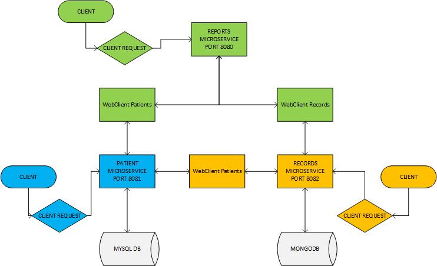

 * * *    * * *   * * * [](https://www.sphinx-doc.org/)

# P10-MEDISCREEN-REPORTS
Project 10 - OpenClassrooms- Mediscreen - ALEXANDRE DUBOIS

## Purpose
Mediscreen specializes in detecting risk factors for disease. Our screenings are using predictive analysis of patient populations at an affordable cost

This application is designed to:

- to handle a MySQL Database

- handle patient's records in a Mongo DB

- provide a screening of all patients according to specific criteria (see ENUM classes inside microservice REPORT)

## Architecture Overview
Below, you will find an architecture Overview of Mediscreen:



## Prerequisites to run
- Java JDK11
- Gradle 4.8.1
- Docker
- MySQL 8.0
- MongoDB Compass & an account


## Installing
1. Install **Java**: https://www.oracle.com/java/technologies/javase-downloads.html

2. Install **Gradle**: https://gradle.org/install/

3. Install Docker Desktop: https://docs.docker.com/docker-for-windows/ or https://docs.docker.com/docker-for-mac/

4. Install **MySQL**: https://dev.mysql.com/downloads/mysql/

5. Install **MongoDB Compass**: https://www.mongodb.com/products/compass

## Technical Specifications

Mediscreen is composed of 3 microservices:
1. **Reports**
https://github.com/ALEXD2758/P10-MEDISCREEN-REPORTS
2. **Patients**
https://github.com/ALEXD2758/P10-MEDISCREEN-PATIENTS
3. **Records**
https://github.com/ALEXD2758/P10-MEDISCREEN-RECORDS

## Run the application

- **WITH IDE/GRADLE**: Use the BASE_URL_LOCALHOST constant present in files PatientWebClientService/RecordWebClientService in microservice REPORTS :src/main/java/com/mediscreen/reports/service/webclient and in
in microservice RECORDS :src/main/java/com/mediscreen/records/service/
For running the application, either launch it in your IDE or run below command inside the root directory of the 3 microservices.
You will also need to change the mongoDB URL in application.properties of microservice RECORDS, to work with your cluster.
```
$ ./gradlew bootRun
```
- **WITH DOCKER**: Use this exact procedure: 
> 1. Build your application with gradle
```
$ ./gradlew build
```
> 2. Build docker images for each microservice. In each microservice root directory, launch the following command:

```
$ docker build -t NAME_OF_YOUR_IMAGE:TAGVERSION .
```
> 3. Go into root directory of microservice REPORTS and launch this command, which is going to launch and compose the Docker containers from images previously created, but also run them.
You will then see all applications running with Spring Boot.

```
$ docker-compose up
```

**GOOD TO KNOW:** Compose is a tool for defining and running multi-container Docker applications. With Compose, you use a YAML file to configure your application's services. 
Then, with a single command, you create and start all the services from your configuration. ... 
Run docker-compose up and Compose starts and runs your entire app.

## Endpoints

> **GET** - Home
http://localhost:8080/

> **GET** - Patient List
http://localhost:8080/patient/list

> **GET** - Note List
http://localhost:8080/note/list <br>
**OBLIGATORY parameter**: patientId

## Testing
Mediscreen has a full integration and unit test suite in each microservice. You can launch it with the following command inside the root directory:

```
$ ./gradlew test
```

Or for running the tests inside your IDE, follow the link below:
[Work with tests in Gradle](https://www.jetbrains.com/help/idea/work-with-tests-in-gradle.html#configure_gradle_test_runner).

## Reporting
JaCoCo reporting tools are attached to the gradle configuration. Launch these 2 commands to run the tools:
```
$ ./gradlew jacocoTestReport
```
```
$ ./gradlew jacocoTestCoverageVerification
```
